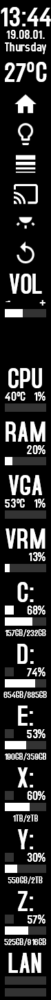
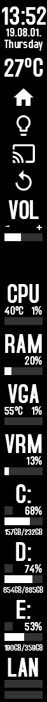

# infinibar

Taskbar-like hardware monitor skin for [Rainmeter](https://www.rainmeter.net/).

Similar hover effect just like the Windows taskbar!

Based on my other skin, [infinimal](https://github.com/infeeeee/infinimal)

## Included skins

#### Hardware monitor

* CPU 
* RAM 
* VGA
* VRM (VRAM)
* HDD (Max. 6 by default)
* Network in, out, and/or both

#### Time and weather

* Clock with date or only clock
* Date
* Temperature left or right aligned

#### Sound

* Volume slider

#### Buttons

* Buttons for starting programs, .bats, websites etc.

#### Other

* Ruler for aligning vertically

## Included layouts:

Horizontal_1920:

| Vertical_1440                                              | Vertical_1080                                              |
| ---------------------------------------------------------- | ---------------------------------------------------------- |
|  |  |

## Screenshots

3440x1440: (This is how I use)

1920x1080:

Black background

## Installation

Download the .rmskin package from [releases](https://github.com/infeeeee/infinibar/releases/latest), and open with rainmeter.

## Settings

All settings are in the `@Resources\Variables.inc` file. Edit with notepad, if something is not clear create an issue.

For weather create a free api key at [openweathermap.org](https://openweathermap.org).

Button settings are in their respective .inis.

You can change the height of the skins in `@Resources\Style.inc`.

#### HWiNFO

From HWiNFO 7.0.2 you have to use the "HWiNFO Gadget" options to read values from HWiNFO.

Follow this tutorial to get the indices of the values: https://docs.rainmeter.net/tips/hwinfo/

After you obtained the values, type them in `@Resources\Variables.inc`.

You can use the speedfan version for CPU if you want.
VGA and VRM skins are HWinfo only.

#### Buttons

Every button is in a separate folder. To change the icon replace the Button.png file with yours, recommended size 48x48px. The icons in the theme by default are from https://material.io/icons/. Download icons from this site, the 48px versions will fit perfectly.

To change the function of the buttons in the Button.ini file change the StartInFolder, Parameter and State options. More info about how to edit them: https://docs.rainmeter.net/manual/plugins/runcommand/

If you want to create a new button just copy and paste one of the folders and rename it. 

#### Tips

* For the transparent taskbar use [TranslucentTB](https://github.com/TranslucentTB/TranslucentTB) - [MS Store link](https://www.microsoft.com/en-us/p/translucenttb/9pf4kz2vn4w9).
* If you always want to see the skin, you can reserve an area from maximized windows with the [DesktopWorkArea](https://docs.rainmeter.net/manual/settings/rainmeter-section/#DesktopWorkArea) Rainmeter setting. However this doesn't work reliably if you constantly detach and attach monitors, like I do. I recommend [DesktopCoral](https://www.donationcoder.com/software/mouser/other-windows-apps/desktopcoral) instead, it's much more consistent and free as well.
* I use [Wget for Windows](http://gnuwin32.sourceforge.net/packages/wget.htm) for the buttons, I send get requests to my other computers.

## Troubleshooting

* When some of the texts don't use the font, I recommend installing it system-wide. Font file location: @Resources\Fonts.

## Acknowledgments

The font used in the skin is Accidental Residency, created by Tepid Monkey. http://www.tepidmonkey.net/

Volume slider is based on a skin created by UNIGHT(http://unight.deviantart.com/) modded by DISCONNECTVD(http://dscnctvd.deviantart.com/)

Hwinfo skins are based on the example skin by Nick Connors. 

Weather icons from icons8(https://icons8.com).

## License

Creative Commons BY-NC-SA 3.0
